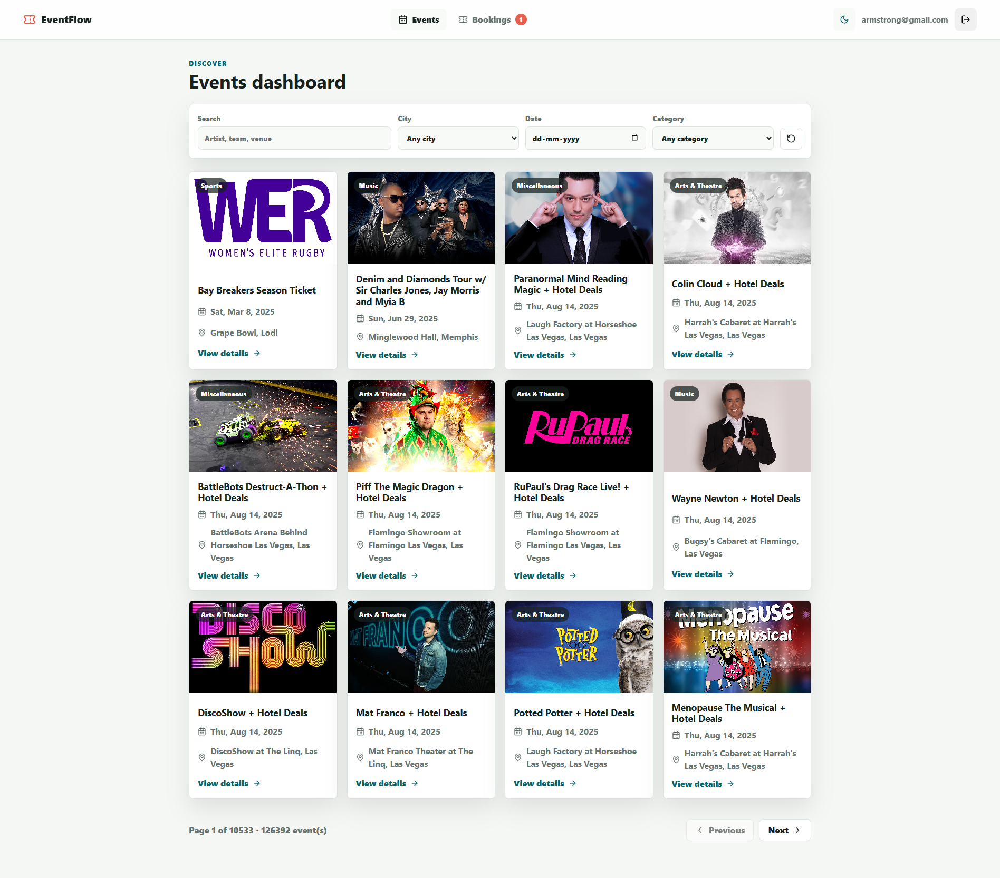
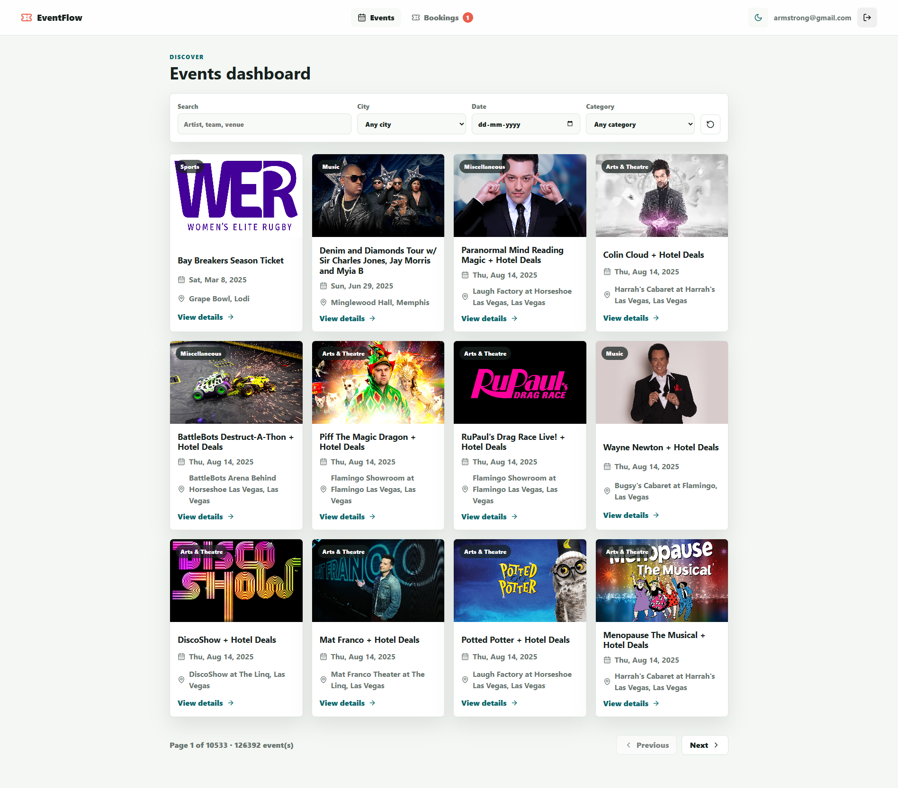
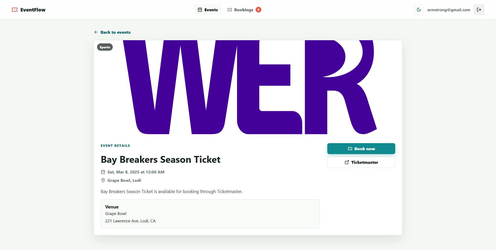
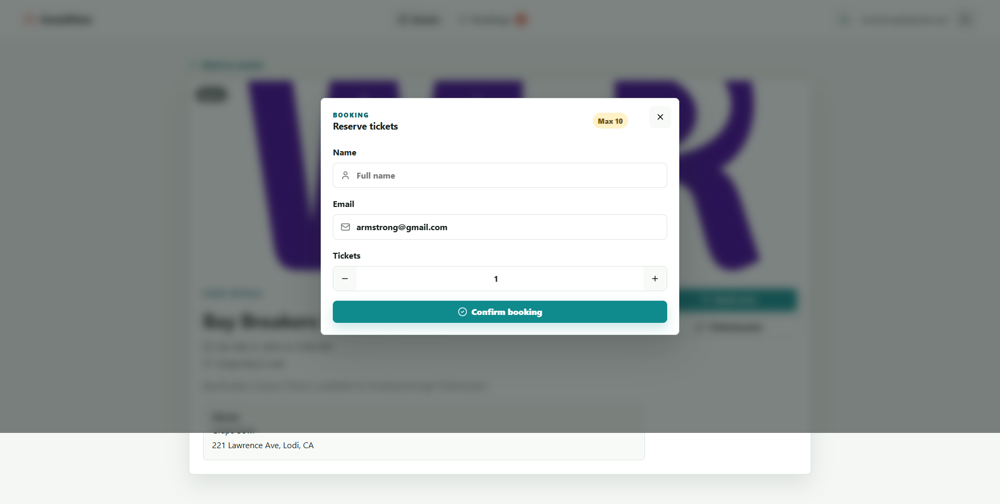
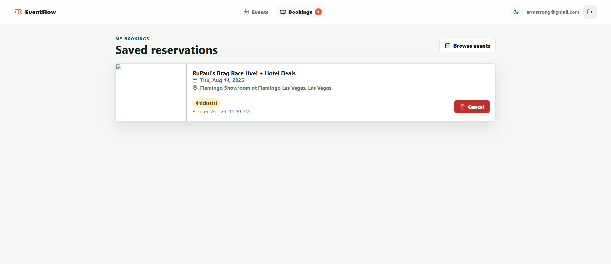

# EventFlow

EventFlow is a React event booking app built around the Ticketmaster Discovery API. Users can sign in, browse live event data, filter events, view event details, reserve tickets through a mock booking flow, manage saved bookings, and switch between light and dark themes.

## Screenshots

### Events Dashboard





### Event Details



### Booking Modal



### My Bookings



## Features

- Authentication with persisted local login state
- Protected event and booking routes
- Ticketmaster-powered event listing and detail pages
- Dynamic filters for keyword, city, date, and category
- API-driven city and category dropdown options
- Debounced keyword search
- Paginated event browsing with scroll-to-top behavior
- Mock ticket booking with validation and localStorage persistence
- Booking cancellation
- Light/dark theme system with system preference detection
- Responsive layout for desktop and mobile screens

## Tech Stack

- React 19
- TypeScript
- Vite
- React Router
- TanStack Query
- Context API
- CSS variables for global theming
- Ticketmaster Discovery API

## Getting Started

Install dependencies:

```bash
npm install
```

Create a local environment file:

```bash
cp .env.example .env.local
```

Add your Ticketmaster consumer key:

```bash
VITE_TICKETMASTER_API_KEY=your_ticketmaster_consumer_key
```

Start the development server:

```bash
npm run dev
```

Build for production:

```bash
npm run build
```

## Project Structure

```text
src/
  app/                 App shell and route composition
  features/
    auth/              Login, auth context, protected routes
    bookings/          Booking form, booking state, bookings page
    events/            Ticketmaster API adapter, event pages, event UI
    theme/             Theme context and toggle button
  lib/                 Shared formatting, ID, and storage helpers
  styles/              Global CSS and theme variables
  types/               Shared TypeScript domain types
```

## Notes

The booking flow is intentionally local and mock-based for the assignment: bookings are saved to local state and `localStorage`. Event data is loaded from Ticketmaster, so a valid `VITE_TICKETMASTER_API_KEY` is required for normal use.
